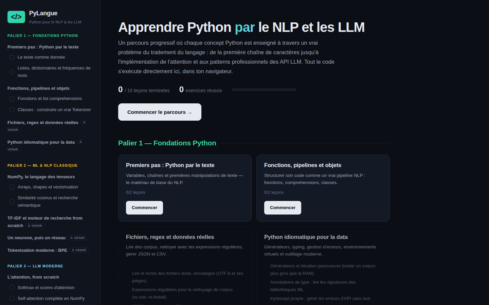
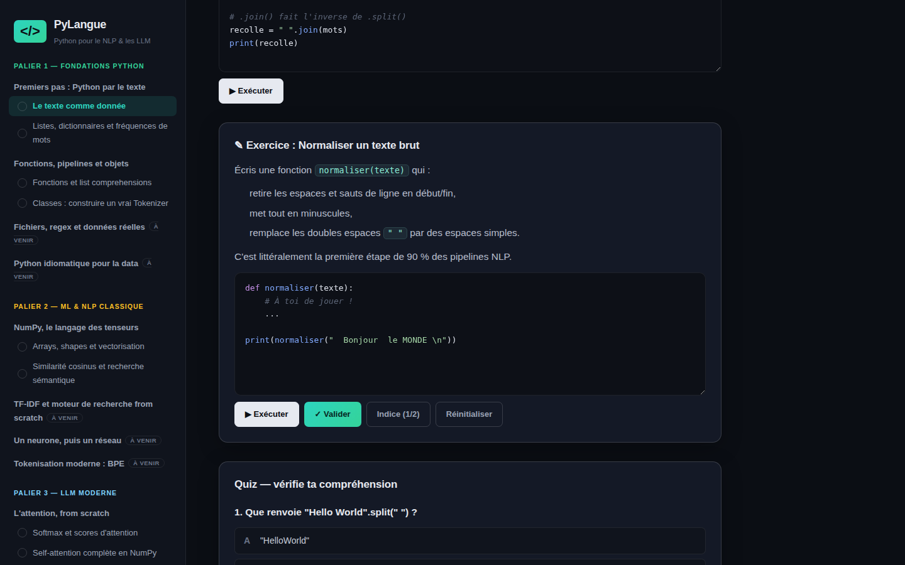

# PyLangue

**Apprendre Python à travers le NLP et les LLM** — un parcours interactif complet (13 modules, 39 leçons, 117 exercices) où chaque concept Python est enseigné via un vrai problème de traitement du langage : de la première chaîne de caractères jusqu'au bloc transformer complet en NumPy, au RAG de bout en bout et à la boucle agentique.

**Essayer en ligne → [perrineqhn.github.io/pylangue](https://perrineqhn.github.io/pylangue/)**

Tout le code Python s'exécute directement dans le navigateur grâce à [Pyodide](https://pyodide.org) (WebAssembly) : aucune installation, aucun serveur, aucune clé d'API.



## Le concept

La plupart des ressources sont soit du Python généraliste, soit des cours de ML qui supposent les bases déjà acquises. PyLangue fait le pari inverse : **le NLP comme fil conducteur dès la première ligne de code**. On apprend les dictionnaires en construisant un vocabulaire, les classes en écrivant un tokenizer, NumPy en calculant des similarités d'embeddings, et on aboutit à la self-attention du papier *Attention Is All You Need* — implémentée soi-même, testée automatiquement.

Chaque leçon combine explications, exemples exécutables et modifiables, exercices avec tests automatiques, indices progressifs, solution de référence et quiz.



## Curriculum

**Palier 1 — Fondations Python** *(via le texte)*

| Module | Statut |
|---|---|
| Premiers pas : Python par le texte | ✅ disponible |
| Fonctions, pipelines et objets (tokenizer complet en POO) | ✅ disponible |
| Fichiers, regex et données réelles | ✅ disponible |
| Python idiomatique pour la data | ✅ disponible |

**Palier 2 — ML & NLP classique**

| Module | Statut |
|---|---|
| NumPy, le langage des tenseurs | ✅ disponible |
| TF-IDF et moteur de recherche from scratch | ✅ disponible |
| Un neurone, puis un réseau (sentiment analysis) | ✅ disponible |
| Tokenisation moderne : BPE | ✅ disponible |

**Palier 3 — LLM moderne**

| Module | Statut |
|---|---|
| L'attention, from scratch (softmax, température, QKV) | ✅ disponible |
| Anatomie complète d'un transformer | ✅ disponible |
| Coder avec les API LLM (messages, sorties structurées) | ✅ disponible |
| RAG de bout en bout | ✅ disponible |
| Agents, tool use et évaluation | ✅ disponible |

## Fonctionnalités

- **Exécution Python réelle dans le navigateur** (Pyodide/WebAssembly), NumPy inclus
- **Validation automatique** des exercices par tests unitaires, avec messages d'erreur pédagogiques
- **Indices progressifs** et solution de référence débloquée après réussite
- **Quiz** avec explications détaillées pour chaque réponse
- **Suivi de progression** sauvegardé dans le navigateur, transfert entre appareils par lien/QR code, export/import JSON
- **Synchronisation cloud optionnelle** par code personnel (voir [SYNC_SETUP.md](SYNC_SETUP.md))
- **Responsive** : utilisable sur ordinateur, tablette et mobile
- **Un seul fichier HTML** : fonctionne aussi hors ligne en local (après le premier chargement de Pyodide)

## Utilisation

**En ligne** : [perrineqhn.github.io/pylangue](https://perrineqhn.github.io/pylangue/) — rien à installer.

**En local** : télécharger `docs/index.html` et l'ouvrir dans un navigateur. Une connexion est nécessaire à la première exécution de code (chargement du moteur Python, ~10 s), puis tout est instantané.

## Développement

Stack : React 18 + TypeScript + Vite, bundlé en fichier unique avec Parcel + html-inline.

```bash
npm install     # ou pnpm install
npm run dev     # serveur de développement
```

Structure du code :

```
src/
├── data/modules/m*.ts     # le contenu pédagogique, un fichier par module
├── data/tier{1,2,3}.ts    # agrégateurs par palier
├── hooks/usePyodide.ts    # chargement et exécution Python (CDN avec fallback)
├── components/            # Sidebar, Home, LessonView, CodeRunner, QuizBlock
└── lib/                   # types, rendu markdown, coloration syntaxique, persistance
```

### Ajouter un module

Le contenu est entièrement déclaratif : un module est un objet TypeScript dans `src/data/`. Pour développer un module marqué `status: 'outline'`, il suffit de remplir son tableau `lessons` en suivant le format des modules existants (sections `text`, `code`, `exercise`, `quiz`). Les tests d'un exercice sont du Python : des `assert` avec messages en français, terminés par `print("TESTS_PASS")`.

Les contributions sont bienvenues : nouvelles leçons, nouveaux exercices, corrections.

## Déploiement

Le site est servi par GitHub Pages depuis le dossier `docs/`. Après modification du code : recompiler le bundle en fichier unique, le placer dans `docs/index.html`, commit et push.

## Licence

MIT — voir [LICENSE](LICENSE).
